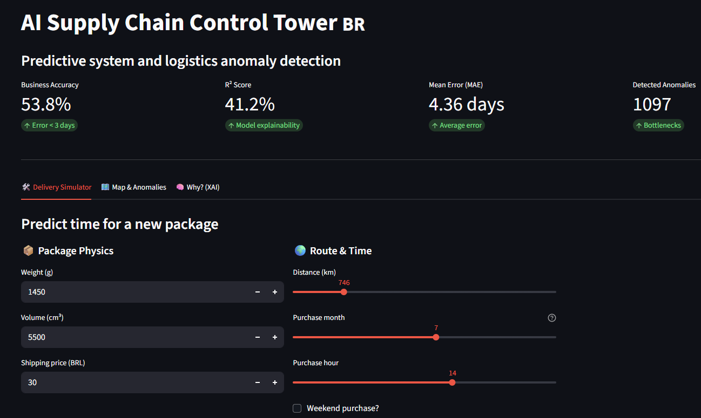

# Logistics AI Control Tower

Delivery time prediction system for Brazilian e-commerce. This project analyzes data from Olist - one of the largest marketplace platforms in Brazil.

## Business Problem

E-commerce customers want to know when their package will arrive. Sellers want to optimize logistics. This project tries to answer the question: **can we predict delivery time based on available data?**

Spoiler: yes, but only partially (~41% of variance). The rest depends on things we don't have in the data - weather, traffic, courier availability.

## Results

R² Score - 41.2%
Mean Error - 4.4 days
Accuracy (<3 days error) - 54%

Is this good? For delivery time prediction - yes, it's a decent result. Most factors affecting delivery are outside transactional data.

## Project Structure

├── main                    # Main script - model training
├── src/
│   ├── loader.py          # Data fetching from Kaggle
│   ├── processing.py      # Cleaning + feature engineering
│   ├── model.py           # Anomaly detection (Isolation Forest)
│   ├── prediction.py      # XGBoost model
│   └── dashboard.py       # Streamlit interface
├── models/                 # Saved models (.pkl)
├── Dockerfile
└── requirements.txt

## Key Model Features

After several iterations, the most important features turned out to be:
- **Distance** (~26%) - calculated using Haversine formula from zip codes
- **Purchase month** (~15%) - seasonality (Black Friday, holidays)
- **Customer location** (~11%) - some regions have weaker infrastructure

## How to Run

### Locally
```bash
pip install -r requirements.txt
python main              # trains the model
streamlit run src/dashboard.py  # starts dashboard
```

### Docker
```bash
docker build -t delivery-app .
docker run -p 8501:8501 delivery-app
```

Dashboard will be available at `http://localhost:8501`

## Stack

- Python 3.12
- XGBoost (regression)
- Scikit-learn (preprocessing, Isolation Forest)
- Streamlit + Plotly (dashboard)
- Docker

## Lessons Learned

1. **Data leakage is sneaky** - it's easy to accidentally use information from the future
2. **Removing outliers is a trade-off** - improves metrics, but will the model work on extreme cases?
3. **Feature engineering > more data** - well-designed features give more than raw columns
4. **41% R² is not a failure** - for some problems it's simply the ceiling given the nature of the data

## Dashboard Preview

### Feature Importance


### Geographic Distribution of Anomalies


### Metrics and Delivery Simulator


## Dataset

[Olist Brazilian E-Commerce](https://www.kaggle.com/datasets/olistbr/brazilian-ecommerce) - public dataset with ~100k orders from 2016-2018.

---

Project created as part of Data Engineering / ML portfolio.
